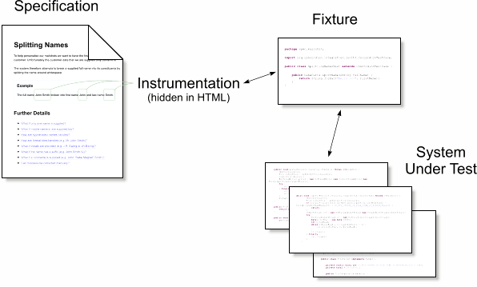

# Acceptance Testing a Bank Account

You are part of the development team responsible for building out a new online retail bank offering. In a [previous session](https://github.com/xp-dojo/tdd-bank-account-java), you built out basic account functions like depositing and withdrawing funds. Now, the product owner wants to build out the next phase making the offering more appealing to those customers just waiting to sign up.

# Prerequisites

You will need Java and an IDE.

1. Clone the repository with the following command.

   `git clone https://github.com/xp-dojo/atdd-bank-account`
  
   If you have problems with SSL, you can try the following.
   
   `git clone -c http.sslVerify=false https://github.com/xp-dojo/atdd-bank-account`
   
   If you have problems with a proxy, you can `unset http_proxy` and `unset https_proxy` (or equivalent for your OS).

1. Open the project from IntelliJ IDEA (community edition is fine). 

1. Make sure you can run the *unit* tests (make a change and see one or more tests fail).

1. Make sure you can run the *acceptance* tests. Hint: run the `Index.java` just like an ordinary test.

# Instructions

This session is all about working with your customers (in this case the product owner) to understand their requirements and writing acceptance tests that you can show them to make sure you've understood them correctly and they're happy with what you're building. Just like the TDD session, you should write your acceptance tests *before* the implementation and think about small, iterative development cycles.

> **Iterative vs incremental development**: do you know the difference? Ask an instructor if you're not sure.

## Structure

1. You should start by asking the product owner what she wants you to do. Read the [transcript](TRANSCRIPT.md) of the interview you conducted last week to remind yourselves of the details, and if there are enough instructors, they will be posing as product owners to field any clarifying questions you may have in person.

1. Write one or more acceptance tests. Capture what you think the product owner's acceptance criteria are, in **business language**. Tools like Concordion and Cucumber allow you to write these "specifications" in (more or less) English. Whatever format you choose, you shouldn't be writing code at this stage but *specifications*.

1. Write "fixture" or "steps" code to bridge your human readable specification to the code that implements the business logic. 

1. Make your specifications *executable*. This is where you wire the test fixture code from step 3. to the specifications in step 2. Ask an instructor about syntax if you get hung up.

1. Most of this business logic code, or API is already implemented for you but you may need to write more. 

> **What do you think is meant by "test fixture"?**
> 
> In science, a fixture is often physical apparatus used to support a test specimen during an experiment. The experiment or test is distinct from the apparatus that supports it. Unit testing frameworks often muddy this idea because they expect tests to include test support code (the fixture part) as well as the actual test scenarios (the experiment part).

## Specifications and Fixtures

The majority of tooling helps abstract the customer authored acceptance criteria or _specifications_ from the test fixture code that proves them. By keeping these two ideas separate, your test code will continue to work as the underlying system grows. Without the seperation of concerns, your specifications become brittle and require more maintenance as you refine your understanding.

The [Concordion](https://concordion.org/tutorial/java/html/) tool describes the idea graphically like this.

You will _bridge_ your specifications (in this case written in HTML but they may be so called "feature" files) to executable code through _instrumentation_. The specifics vary between tools, but the basic concept is the same. The skill is in keeping the specification abstract and all the implementation detail in the fixture, test and production code.

## Hints

The steps above are *iterative*:  you're meant to go through them more than once (and not always in the same order). Try something small and get feedback. Can you think of a way to get feedback and refine using the mechanisms above?

# Additional Reading

[Concordion documentation](https://concordion.org/discussing/java/html/)
[Problems with Acceptance Testing](http://www.softwaretestingmagazine.com/knowledge/problems-acceptance-testing-can-cause/)
